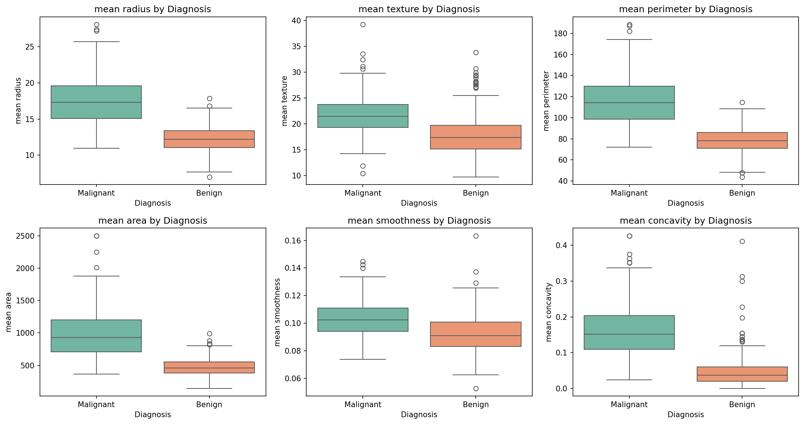
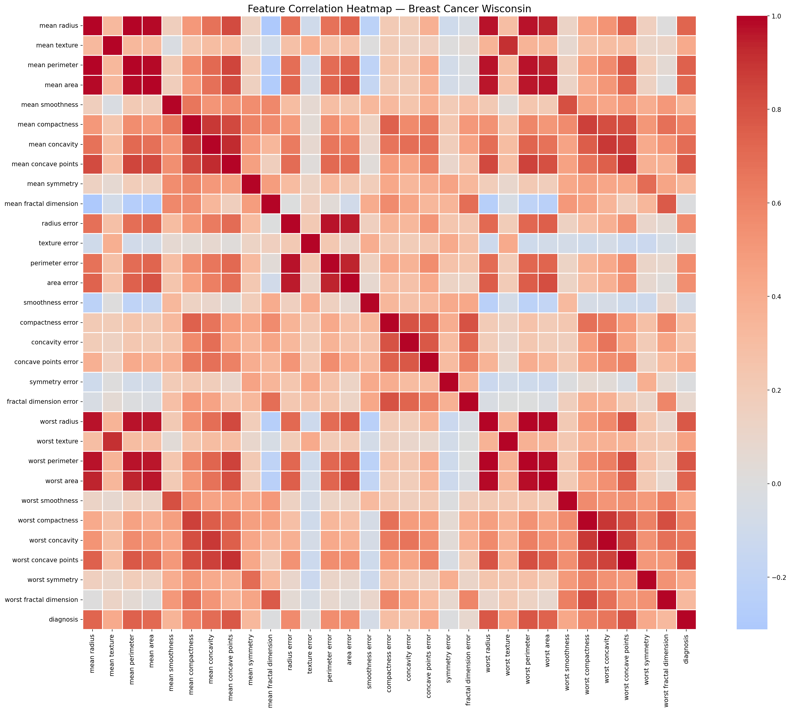
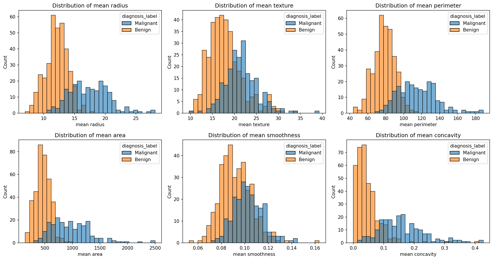
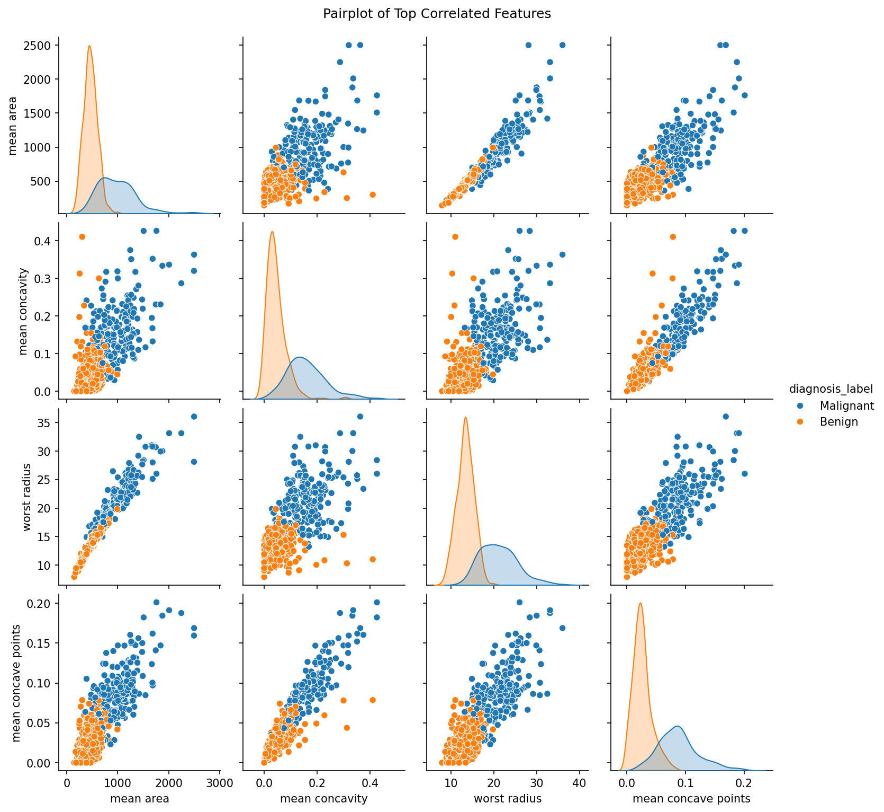
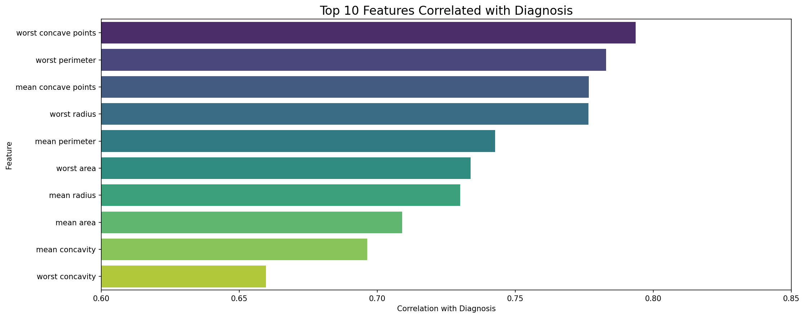

# Breast Cancer Wisconsin — Exploratory Data Analysis

## Overview
This project performs an exploratory data analysis (EDA) on the Breast Cancer 
Wisconsin dataset to identify the strongest predictors of malignancy using 
Python data science tools.

**Dataset:** sklearn Breast Cancer Wisconsin (569 samples, 30 features)  
**Goal:** Explore feature distributions and identify patterns that differentiate 
malignant from benign cases.

## Project Structure
```
breast-cancer-eda/
│
├── data/
|   ├── .gitkeep
├── images/
|   ├── boxplots.png
│   ├── correlation_heatmap.png
│   ├── histograms.png
|   ├── paiplot.png
│   └── top_correlated_feature.png
├── notebook/
│   └── eda.ipynb
├── requirements.txt
└── README.md
```

## Key Findings
- A dataset of 569 samples with 30 features was used to compare benign and 
malignant cases.
- The class distribution shows a ratio of 63% benign to 37% malignant cases.
- Malignant cases displayed higher variability compared to benign cases and were 
consistently larger in size.
- Size-related features (radius, perimeter, area) were the strongest indicators 
of malignancy, effectively differentiating the two groups.
- Shape irregularity features (concavity, concave points) complemented size 
features, together providing the strongest separation between malignant and 
benign cases.

## Visualizations
### Boxplots


### Correlation Heatmap


### Histograms


### Pairplot of Top Features


### Top_correlated_features


## How to Run
1. Clone the repository
2. Install dependencies: `pip install -r requirements.txt`
3. Launch Jupyter: `jupyter notebook notebook/eda.ipynb`

## Tools Used
- Python 3
- Pandas
- NumPy
- Matplotlib
- Seaborn
- Scikit-learn